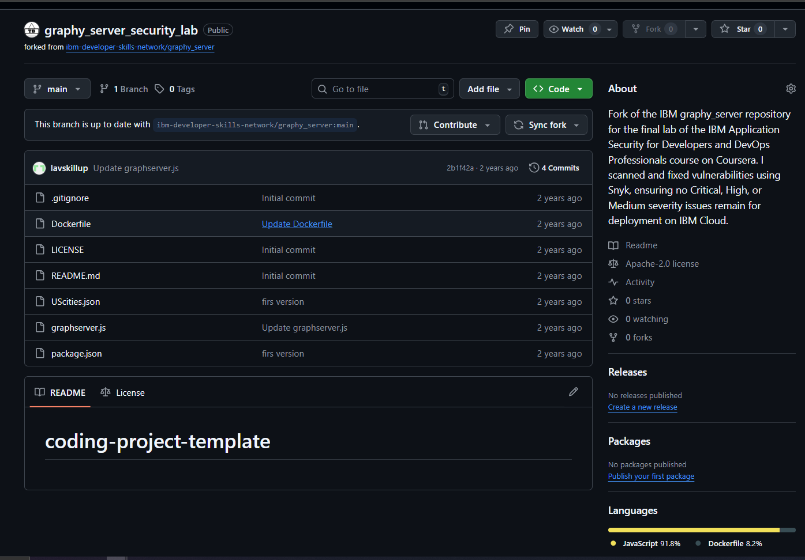
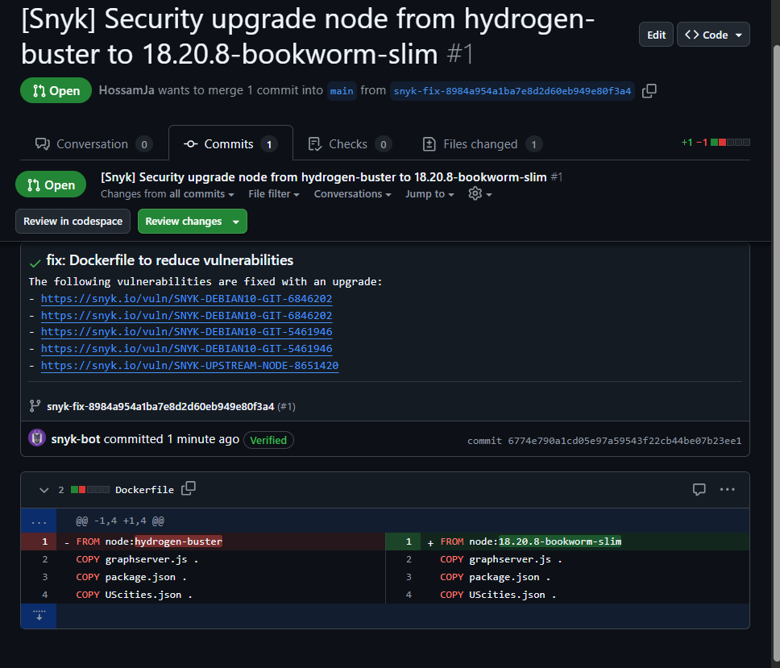

# IBM Application Security for Developers and DevOps Professionals Course - Final Project: Security Vulnerability Scan and Fix

## Overview

This repository contains the completed practice lab for the "Application Security for Developers and DevOps Professionals" course by IBM on Coursera. The lab focuses on identifying and resolving security vulnerabilities in a sample server-side application, originally forked from the `fgxgm-SecurityCheckSample` repository. As part of this exercise, I performed a vulnerability scan using Snyk, analyzed the severity of issues (Critical, High, Moderate, Low), and implemented fixes, primarily by updating the Node.js version in the Dockerfile. The project demonstrates best practices for securing Dockerized applications and iterative vulnerability management.

## Technologies Used

- **Language**: Node.js
- **Containerization**: Docker
- **Security Scanning**: Snyk
- **Version Control**: GitHub
- **Deployment**: Cloud-ready (via Docker)

## Project Structure

```
.
├── Dockerfile               # Container configuration with updated Node.js version
├── README.md                # This file
├── app.js                   # Sample server-side application code
├── package.json             # Node.js dependencies
├── package-lock.json        # Locked dependency versions
└── screenshots/             # Evidence screenshots (.PNG)
    ├── 01-fork-repo.PNG     # Fork confirmation on GitHub
    ├── 02-snyk-add-project.PNG  # Adding project in Snyk
    ├── 03-scan-report.PNG   # Initial vulnerability scan report
    ├── 04-detailed-vulnerabilities.PNG  # Detailed vulnerability breakdown
    ├── 05-dockerfile-edit.PNG  # Editing Dockerfile on GitHub
    ├── 06-post-fix-scan.PNG    # Updated scan report after fix
    └── 07-low-priority-issues.PNG  # Optional low-priority issues (if addressed)
```

## Setup and Installation

1. **Clone the Repository**:
   ```
   git clone https://github.com/HossamJa/graphy_server_security_lab.git
   cd graphy_server_security_lab
   ```

2. **Prerequisites**:
   - A GitHub account with the forked repository.
   - A Snyk account authenticated with GitHub.

3. **Build the Docker Image**:
   ```
   docker build -t security-check-sample .
   ```

4. **Run the Container**:
   ```
   docker run -p 3000:3000 security-check-sample
   ```
   - Access the app at `http://localhost:3000` (if applicable).

**Note**: Ensure Docker is installed and running on your system. For cloud deployment, adjust the Dockerfile and use a supported platform.

## Features Implemented

### Task 1: Get a Repo Copy
Forked the repository from https://github.com/ibm-developer-skills-network/fgxgm-SecurityCheckSample.git to create a personal copy for modifications.



### Task 2: Scan the Repo
Added the forked repository to Snyk via https://app.snyk.io/login and initiated an automated vulnerability scan.


### Task 3: View Scan Report
Reviewed the Snyk scan report, identifying four severity levels of vulnerabilities (Critical, High, Moderate, Low) in the Dockerfile and application code. Focused on detailed error reports and recommended fixes.


### Task 4: Fix Vulnerabilities
Edited the Dockerfile on GitHub, updating the Node.js version from 18.12.1 to 18.17.1 as recommended by Snyk to address most critical and high-severity issues. Committed the changes.




### Task 5: Verify Vulnerabilities Fix
Re-ran the Snyk scan to confirm the resolution of Critical, High, and Moderate issues. Iterated on fixes until only Low-priority issues remained.


## General Notes

- This lab is based on the IBM-provided `fgxgm-SecurityCheckSample` repository, modified to demonstrate vulnerability scanning and fixing.
- The project is designed to be Dockerized and deployable on the cloud, with security best practices applied.
- Snyk integration requires a GitHub-authenticated account for scanning personal or public repositories.

## License

This project is based on IBM starter code and is intended for educational purposes. See the [LICENSE](LICENSE) file for details (if provided in the starter repo).
